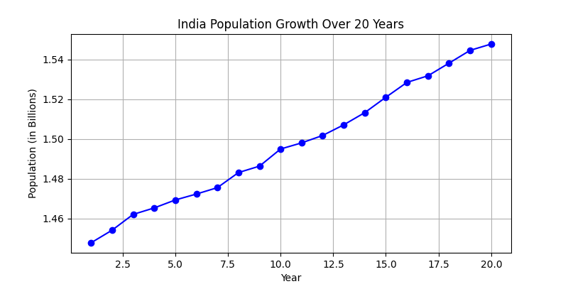
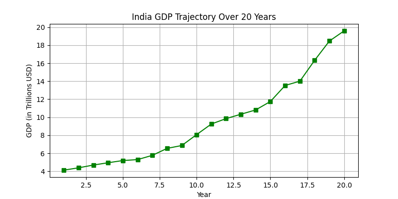
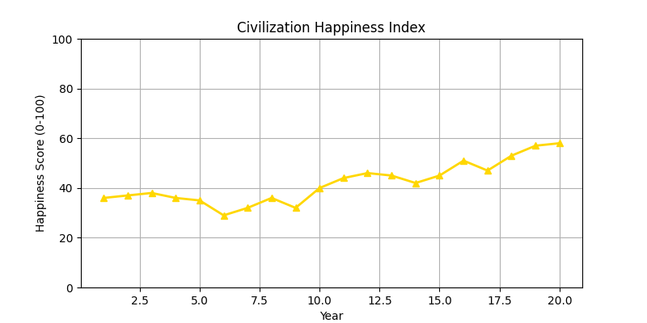
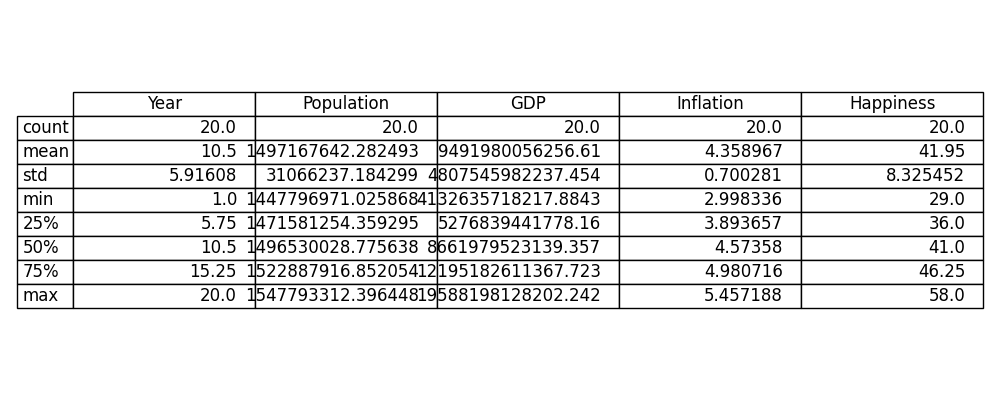

# ProjectDi: Country Simulation & Health Indicators Analysis

Welcome to **ProjectDi**! This project is a Python-based simulation that models the socio-economic and demographic trajectory of a nation (inspired by India) over a 20-year period. By tracking key health and economic indicators, ProjectDi provides a data-driven visualization of how various randomized macro-events can impact a country's growth and the happiness of its civilization.

## 📊 Overview

The simulation initializes with base metrics and projects them year-over-year. It applies realistic growth rates alongside random positive and negative global events to simulate the unpredictability of a real-world economy.

The key indicators tracked are:
- **Population**: Projected growth scaled in billions.
- **Gross Domestic Product (GDP)**: Modeled in Trillions USD, fluctuating based on economic events.
- **Inflation**: Simulated percentage rates impacting the cost of living.
- **Civilization Happiness Index**: A synthesized score (0-100) affected by GDP growth, inflation, and major global events.

### Simulated Macro-Events
The trajectory is influenced by randomized events such as:
- 🚀 **Economic Boom & Breakthroughs**
- 📉 **Recessions**
- 🦠 **Pandemics**
- ☀️ **Droughts**

---

## 📈 Visualizations

The simulation generates comprehensive graphs using `matplotlib` to help visualize these trends over time.

### 1. Population Growth
As seen below, the simulation models a steady population increase over the 20-year period, factoring in a variable growth rate of 0.2% to 0.6%.


### 2. GDP Trajectory
The GDP trajectory demonstrates compounding economic growth, interspersed with fluctuations caused by simulated events like recessions or economic booms.


### 3. Civilization Happiness Index
The happiness index is a dynamic metric. High inflation or pandemics drastically lower the score, while stable growth and breakthroughs increase the overall well-being of the civilization.


### 4. Statistical Summary
A complete statistical breakdown of the simulated 20-year period (mean, standard deviation, quartiles, etc.) provides deep insights into the data distribution.


---

## 🚀 Getting Started

### Prerequisites
To run the simulation and generate the visualizations, you will need Python installed along with the following libraries:
- `numpy`
- `pandas`
- `matplotlib`

You can install the dependencies via pip:
```bash
pip install numpy pandas matplotlib
```

### Running the Simulation
Simply execute the main Python script:
```bash
python ProjectDi.py
```
This will run the simulation logic, print the statistical summary to your console, and display the interactive graphs.

## 🤝 Contributing
Contributions are always welcome! Whether it's adding new indicators (like healthcare quality, education, or carbon emissions) or refining the mathematical models, feel free to open a pull request or submit an issue.

## 📜 License
This project is open-source and available under the standard MIT License.